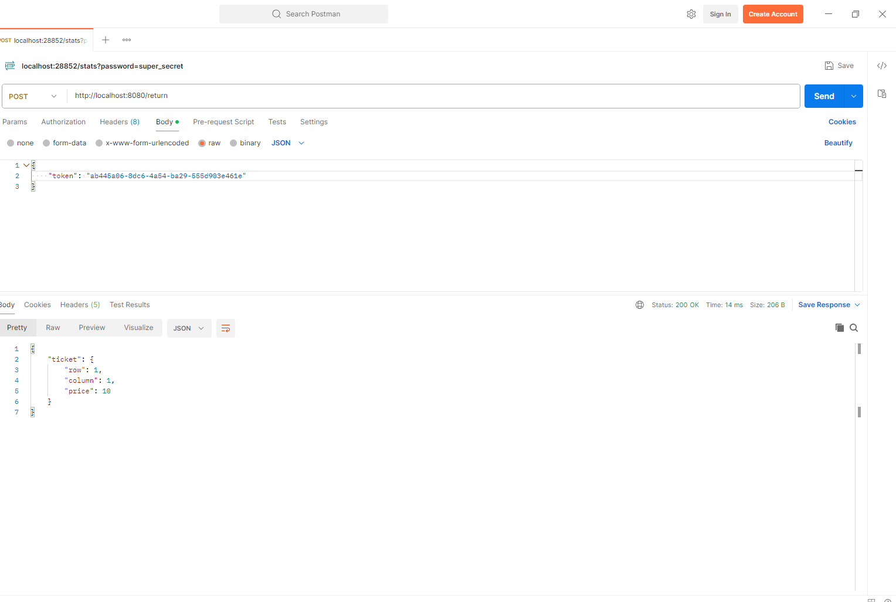

# Cinema-Room-REST
## About project
The idea of this project is from [hyperskill.org](https://hyperskill.org/projects/189?track=12). It is about simulating RESTful service which handles some HTTP requests in controllers, creates services, and responds with JSON objects. All rights reserved.

## How it works?
When you are running this program, you can use POSTMAN app to send some requests (GET, POST) to this app. It has some endpoints, such as:
- */seats* where you can **GET** the array all seats available in this cinema 

- */purchase* where you can **POST** the JSON object in Seats type (like in the picture below) which seat do you want to take. In respond service will give you a UUID token (identifier), which you can use to refund money

- */return* in this endpoint, you can **POST** received earlier UUID token. If token is correct, the service will respond with seat reservation information

- */stats* this is special endpoint. Using **GET** method and providing "password=super_secret" parameter, you can get JSON with statistics about income, available and seats

## How to install?
1. Make sure that you have JAVA installed on your computer.
2. Download "toDownload.jar" file.
3. Go to directory, where you've installed this .jar file.
4. Open Terminal in that directory.
5. Type "java -jar toDownload.jar" in the command line. Your program is running.
6. Open your POSTMAN app or web browser and type: http://localhost:8080/seats
7. Enjoy!

