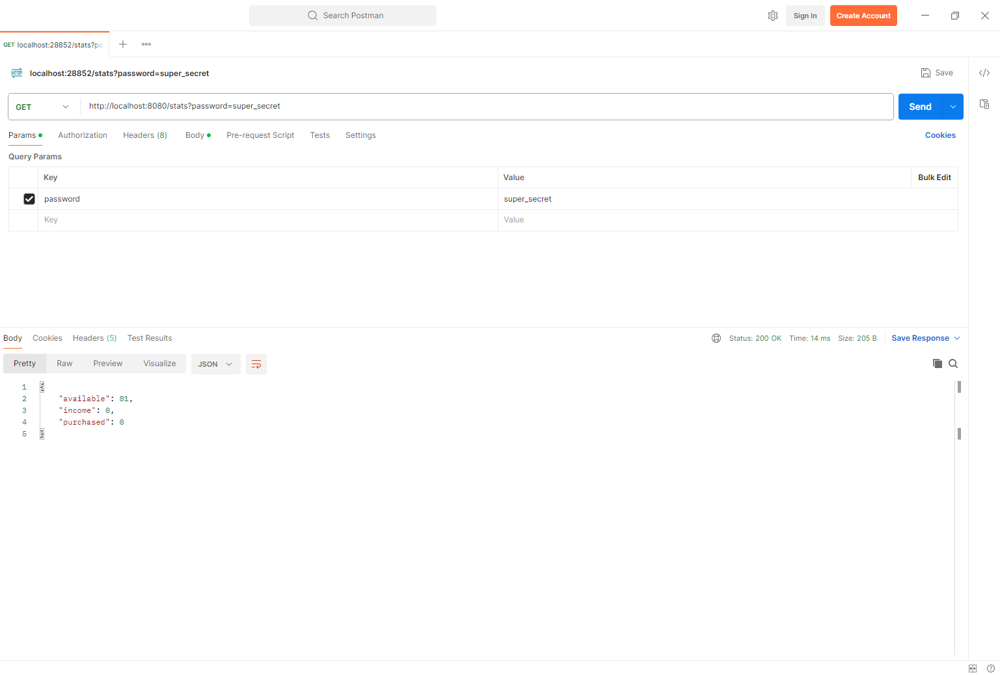

# Cinema-Room-REST
## About project
This is a project from hyperskill.org. It's about simulating RESTful service which handles some HTTP requests in controllers, creates services, and responds with JSON objects.

## How it works?
When you are running this program, you can use POSTMAN app to send some requests (GET, POST) to this app. It has some endpoints, such as:
- */seats* where you can **GET** the array all seats available in this cinema 

- */purchase* where you can **POST** the JSON object in Seats type (like in the picture below) which seat do you want to take. In respond service will give you a UUID token (identifier), which you can use to refund money

- */return* in this endpoint, you can **POST** received earlier UUID token. If token is correct, the service will respond with seat reservation information

- */stats* this is special endpoint. Using **GET** method and providing "password=super_secret" parameter, you can get JSON with statistics about income, available and seats

## How to install?
1. do something
2. do something
3. do something

